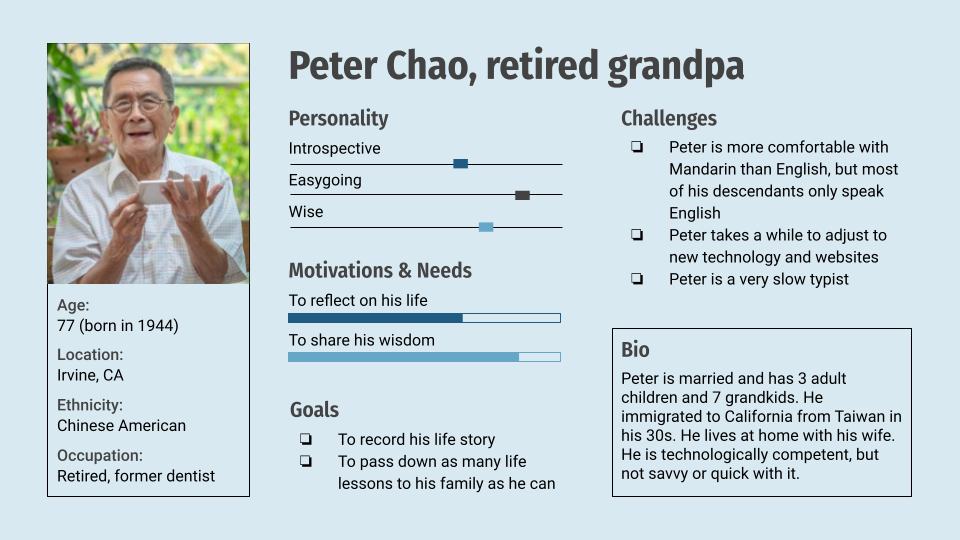
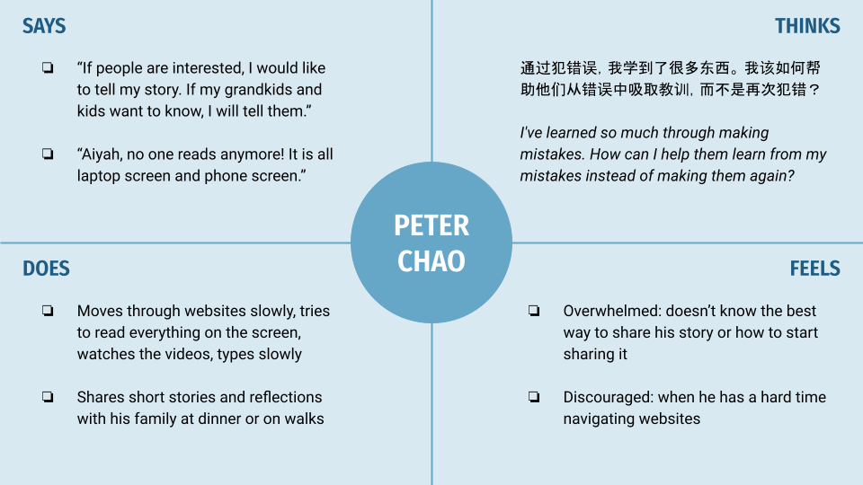
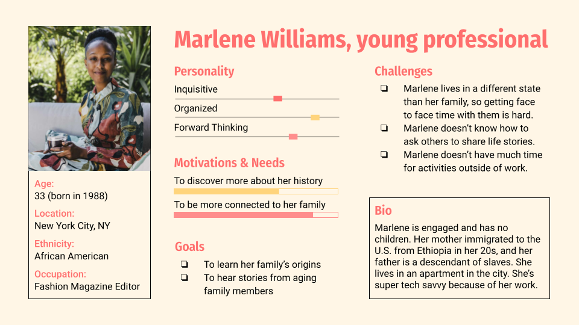
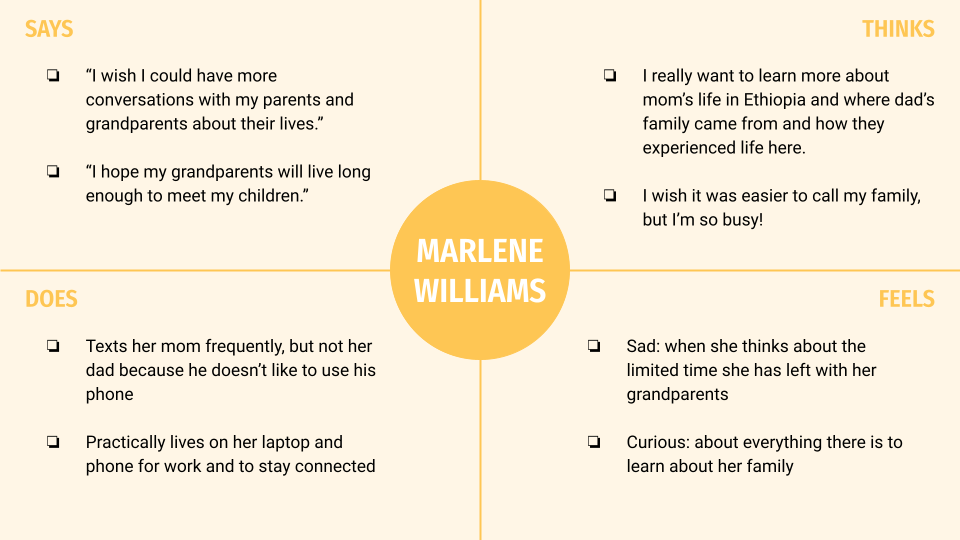

# Assignment 04: UX Storytelling - Joy Hsieh, DH110
## The Purpose of UX Storytelling
**UX storytelling** is a way of giving users a voice and showing off their point of view. It's a method of presenting findings gathered during the user research phase of ideation.
Creating a **persona** helps individual designers shift their own perspectives and guides teams of designers towards a unifed perception of the users. A persona's traits is based off of patterns uncovered from the ethnographic user data.
An **empathy map** brings life to the persona created, and makes it easier to relate to them and design with them in mind.
A **user journey** makes the storytelling even more realistic, and shows how a product could actually help a user.
A **ssage scenario** explains how and why a user may interact with the product.

## Proposed Features
1. **Storytelling Platform** - provides users with prompts that cue them to share a short story about their lives. Entries can be typed, voice recorded, or video recorded. Recordings are transcribed and saved with the voice or video files.
2. **Email/Text Integration** - lets users send prompts to others. When a user recieves a prompt, they can reply to it with a response and it will be saved to the Storytelling Platform. Users may submit a voice or video recording that will be uploaded and transcribed.

## Personas & Empathy Maps
### 1: Peter Chao

### 2: Marlene Williams

## Scenarios
### 1: Peter Chao
#### Why Peter is using this product
>
#### How Peter is using this product
>
### 2: Marlene Williams
#### Why Marlene is using this product
>
#### How Marlene is using this product
>

## Credits
- User Persona Template: https://slidesgo.com/theme/linear-buyer-persona-infographics-with-pictures
- "Peter Chao" Picture: https://image.freepik.com/free-photo/happy-elderly-asian-old-man-using-smartphone-outdoor_37129-833.jpg
- "Marlene Williams" Picture: https://images1.westend61.de/0001388570pw/portrait-of-fashionable-young-woman-sitting-on-couch-in-garden-drinking-black-coffee-MFF05797.jpg
