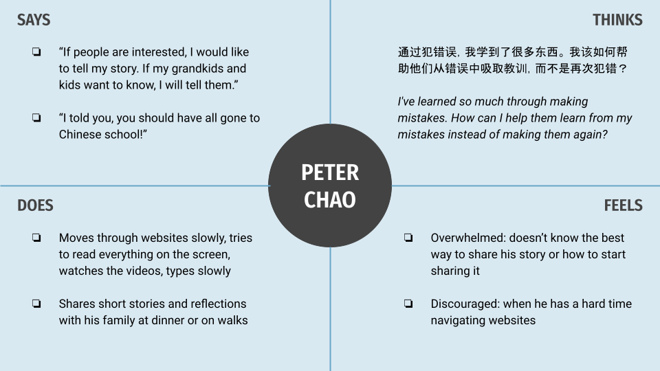

# Assignment 04: UX Storytelling - Joy Hsieh, DH110
## The Purpose of UX Storytelling
> **UX storytelling** is a way of giving users a voice and showing off their point of view. It's a method of presenting findings gathered during the user research phase of ideation.
Creating a **persona** helps individual designers shift their own perspectives and guides teams of designers towards a unifed perception of the users. A persona's traits is based off of patterns uncovered from the ethnographic user data.
An **empathy map** brings life to the persona created, and makes it easier to relate to them and design with them in mind.
A **user journey** makes the storytelling even more realistic, and shows how a product could actually help a user.
A **ssage scenario** explains how and why a user may interact with the product.

## Proposed Features
1. **Storytelling Platform** - provides users with prompts that cue them to share a short story about their lives. Entries can be typed, voice recorded, or video recorded. Recordings are transcribed and saved with the voice or video files.
2. **Email/Text Integration** - lets users send prompts to others. When a user recieves a prompt, they can reply to it with a response and it will be saved to the Storytelling Platform. Users may submit a voice or video recording that will be uploaded and transcribed.

## Personas & Empathy Maps
### 1: Peter Chao

### 2: Marlene Williams

## Scenarios
### 1: Peter Chao
#### Why Peter is using this product
>
#### How Peter is using this product
>
### 2: Marlene Williams
#### Why Marlene is using this product
> Marlene is getting ready to start a new family with her fiance, which has made her think a lot about her parent’s lives when they were her age. Did they share a lot of the same concerns as her? Was her mom as excited about marrying her dad as she is about marrying her fiance? She talks to her mom regularly, but about trivial things like the Bachelorette contestants or new drink recipes. She wants to initiate deeper and more meaningful conversations with her mom while continuing to communicate in the way that works for them-- text.
#### How Marlene is using this product
> Marlene makes a joint account on behalf of herself and her mom. On the “Get Started” page, she inputs both of their phone numbers and emails into the app, which sends an introductory video to her mom that explains what the app is all about. Marlene reads through recommended beginners prompts under the “Prompts” tab, and clicks a checkbox on the ones she likes to select them. She then clicks “Schedule” and the app creates a schedule that shows Marlene when the prompts will be texted to her mom throughout the week, spaced out so that her mom doesn’t get overwhelmed or tired of responding. Marlene’s mom receives an email and a text with a prompt that encourages her to share a story about her life. It asks her to log the year that the story took place. At the end of the week, Marlene receives an email summary of her mom’s responses. She can also view these in the app at anytime she wants, in chronological order or the order that her mom responded in.

## Credits
- User Persona Template: https://slidesgo.com/theme/linear-buyer-persona-infographics-with-pictures
- "Peter Chao" Picture: https://image.freepik.com/free-photo/happy-elderly-asian-old-man-using-smartphone-outdoor_37129-833.jpg
- "Marlene Williams" Picture: https://images1.westend61.de/0001388570pw/portrait-of-fashionable-young-woman-sitting-on-couch-in-garden-drinking-black-coffee-MFF05797.jpg
